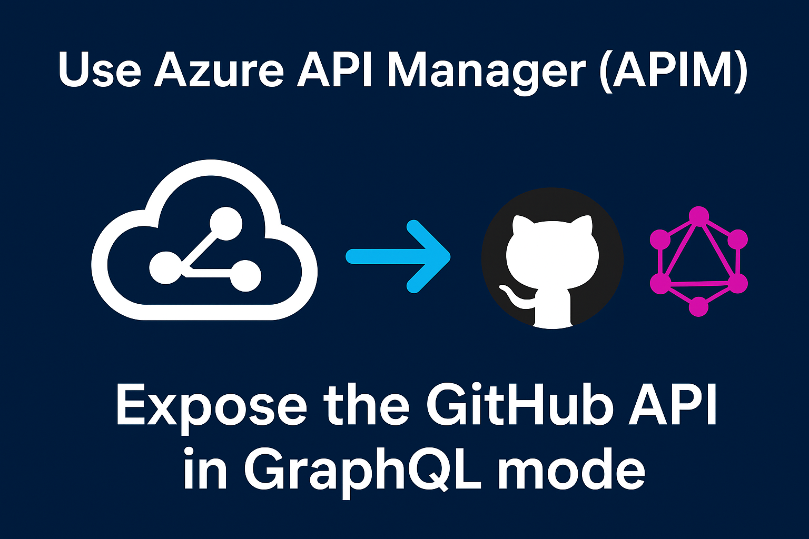

# Azure API Management - GitHub GraphQL Integration

This repository demonstrates how to integrate GitHub's GraphQL API with Azure API Management (APIM).



## Configuration

1. Create a GitHub Personal Access Token:
   - Go to https://github.com/settings/tokens
   - Click "Generate new token (classic)"
   - Give it a descriptive name (e.g., "GraphQL Sample App")
   - Select the following scopes:
     - `read:user` - to read user profile information
     - `repo` - to access repository information (required for private repositories)
   - Click "Generate token"
   - **Important**: Copy the token immediately as you won't be able to see it again


2. Trigger the provisioning using `azd provision`, the azd script will prompt for the the `githubToken` parameter

```
$ azd up
  (✓) Done: Downloading Bicep
? Select an Azure Subscription to use: 26. external-bmoussaud-ms (xxxxxxxx-xxxx-xxxx-xxxx-xxxxxxxxxxxx)
? Enter a value for the 'githubToken' infrastructure secured parameter: [? for help] *********************************************************************************************
? Pick a resource group to use: 1. Create a new resource group
? Select a location to create the resource group in: 51. (US) East US 2 (eastus2)
? Enter a name for the new resource group: rg-graphql-dev

Packaging services (azd package)


Provisioning Azure resources (azd provision)
Provisioning Azure resources can take some time.

Subscription: external-xxxxxxxx-xx (xxxxxxxx-xxxx-xxxx-xxxx-xxxxxxxxxxxx)

  You can view detailed progress in the Azure Portal:
  https://portal.azure.com/#view/HubsExtension/DeploymentDetailsBlade/~/overview/id/%2Fsubscriptions%2Fxxxxxxxx-xxxx-xxxx-xxxx-xxxxxxxxxxxx%2FresourceGroups%2Frg-graphql-dev%2Fproviders%2FMicrosoft.Resources%2Fdeployments%2Fdev-1762943049

  (✓) Done: Log Analytics workspace: log-analytics-tgebslojbs6y2 (20.864s)
  (✓) Done: Application Insights: app-insights-tgebslojbs6y2 (4.46s)
  (✓) Done: Azure API Management: apim-tgebslojbs6y2 (1m8.741s)

```

### Testing Your GraphQL API

0. **Settings**
```bash
cd github-graphql-sample
azd env get-values  > .env
source .env
```

or manually

```bash
cd github-graphql-sample
export GITHUB_TOKEN=your_github_token
export GITHUB_GRAPHQL_API_URL=https://apim-rkh7dxqqe2ol4.azure-api.net/github-graphql
export GITHUB_APIM_SUBSCRIPTION_KEY=your_subscription_key
```

1. **Test with curl using github_api**:
```bash
curl -X POST "https://api.github.com/graphql" \
  -H "Authorization: Bearer ${GITHUB_TOKEN}" \
  -H "Content-Type: application/json" \
  -d '{"query": "{ viewer { login name } }"}'
```

2. **Test with curl**:
```bash
curl -X POST "${GITHUB_GRAPHQL_API_URL}" \
  -H "Ocp-Apim-Subscription-Key: ${GITHUB_APIM_SUBSCRIPTION_KEY}" \
  -H "Content-Type: application/json" \
  -d '{"query": "{ viewer { login name } }"}'
```

3. **Test with the Python client**:
```bash
uv run python github_graphql_client.py viewer
```

### Sample GraphQL Queries

**Get authenticated user info:**
```graphql
query {
  viewer {
    login
    name
    email
  }
}
```

**Get repository information:**
```graphql
query {
  repository(owner: "octocat", name: "Hello-World") {
    name
    description
    stargazerCount
    forkCount
  }
}
```

## Integrate Fabric GraphQL endpoint in APIM

### Configure Fabrik
1. Create a new Lakehouse, Load the data (`fabriq-graphql/factory_iot_data.csv`) and transform them into a table
2. Create a new `API For GraphQL` item, bind it to the table.
3. At the workspace level,using the `Manage Acess` menu; assign the managed identity as a contributor of the workspace.
3. Copy the endpoint and set value in infra/main.parameters.json
```json
   "fabricGraphQLEndpoint": {
      "value": "https://cb0442cc43ea4c819fea0bba9b62f870.zcb.graphql.fabric.microsoft.com/v1/workspaces/cb0442cc-43ea-4c81-9fea-0bba9b62f870/graphqlapis/64f58335-5d12-441d-b5e5-51778048a084/graphql"
    }
```
4. Trigger `azd provision` to update the Azure APIM Configuration

### Test

```bash
cd fabriq-graphql
uv venv
source .venv/bin/activate
azd env get-values > .env
uv run fabric_graphql_apim.py 
```
 
Documentation:
* https://learn.microsoft.com/en-us/fabric/data-engineering/get-started-api-graphql
* https://learn.microsoft.com/en-us/fabric/data-engineering/api-graphql-azure-api-management


## 📚 Additional Resources

- [GitHub GraphQL API Documentation](https://docs.github.com/en/graphql)
- [Azure API Management GraphQL Support](https://docs.microsoft.com/en-us/azure/api-management/graphql-apis-overview)
- [GraphQL Best Practices](https://graphql.org/learn/best-practices/)

## 🤝 Contributing

1. Fork the repository
2. Create a feature branch
3. Make your changes
4. Add tests if applicable
5. Submit a pull request

## 📄 License

This project is licensed under the MIT License - see the LICENSE file for details.

